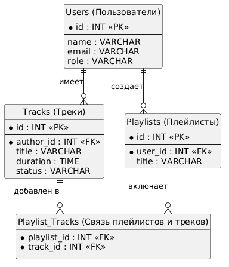
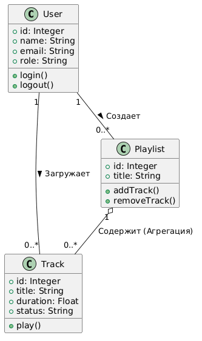
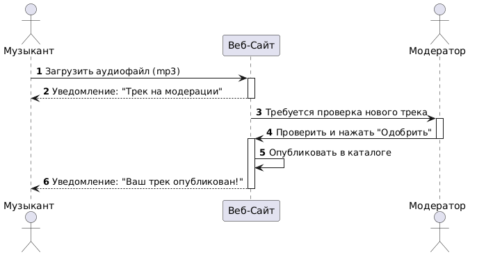
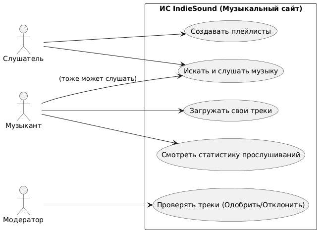
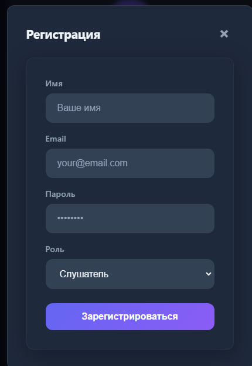
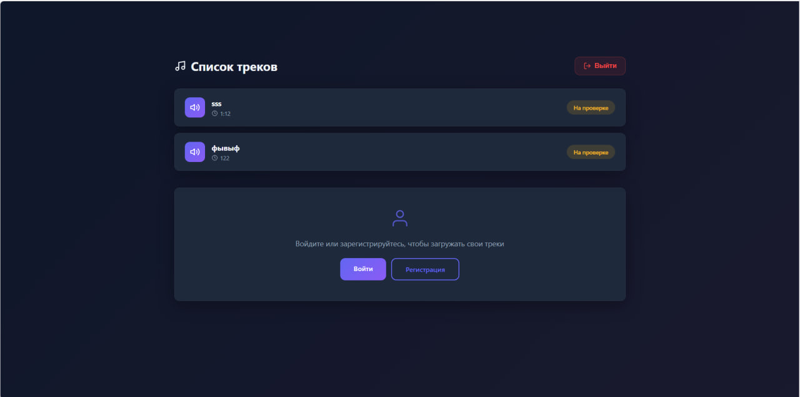
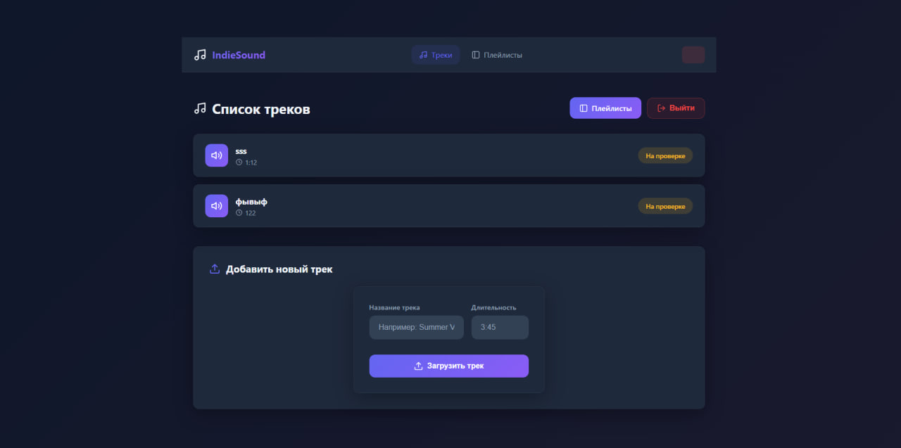
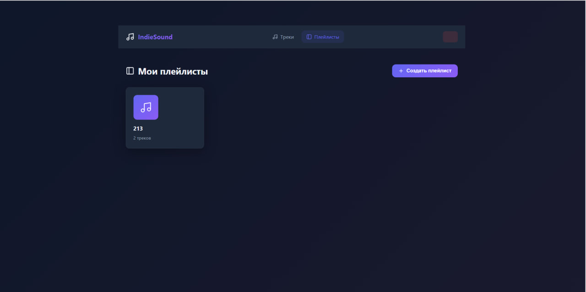

# Описание предметной области
**Проект:** Информационная система «Музыкальный портал IndieSound»

## 1. Описание организации
**Наименование:** Музыкальное агентство «ИндиЗвук» (IndieSound).
**Деятельность:** Организация занимается поиском, продвижением и дистрибуцией независимых музыкальных исполнителей. Агентство помогает начинающим музыкантам находить свою аудиторию, организует прослушивания, занимается выпуском музыкальных альбомов и сбором статистики по популярности артистов. Главная цель компании — объединить талантливых авторов и любителей новой музыки.

## 2. Должности и структура организации
В штате организации работают следующие сотрудники:
*   **Генеральный директор:** определяет стратегию развития компании, утверждает бюджеты и подписывает ключевые договоры.
*   **A&R-менеджер (Менеджер по артистам и репертуару):** занимается поиском новых талантов, отслушивает демо-записи, ведет переговоры с артистами.
*   **Контент-менеджер / Музыкальный редактор:** отвечает за каталогизацию музыки, составляет тематические сборники и проверяет качество аудиозаписей.
*   **Бухгалтер:** занимается расчетом авторских отчислений (роялти) музыкантам, ведет учет доходов и расходов.
*   **PR-менеджер:** занимается рекламой релизов, взаимодействует со СМИ и музыкальными критиками.

## 3. Бизнес-процессы без информационной системы (Как было «до»)
До внедрения информационной системы процессы в компании выглядели следующим образом:
1.  **Прием демо-записей:** Музыканты отправляют свои треки на почту агентства в виде прикрепленных архивов, ссылок на файлообменники или приносят музыку на флешках/CD-дисках лично в офис.
2.  **Отбор материала:** A&R-менеджер вручную скачивает треки, слушает их через стандартные медиаплееры, делает пометки в бумажном блокноте или таблице Excel. Из-за отсутствия структуры письма с хорошей музыкой часто теряются в спаме.
3.  **Публикация и дистрибуция:** Если артист одобрен, контент-менеджер вручную рассылает его треки по радиостанциям и музыкальным критикам. Музыка хранится на локальных жестких дисках в офисе, что создает риск потери данных.
4.  **Взаимодействие со слушателями:** Слушатели могут ознакомиться с музыкой только на редких живых концертах, организованных агентством, или покупая физические носители (CD, винил).
5.  **Расчет отчислений:** Бухгалтер собирает отчеты о продажах физических копий и вручную в Excel высчитывает процент, который полагается каждому музыканту. Процесс занимает несколько недель и сопровождается ошибками.

---

## 4. Описание информационной системы (ИС)

### 4.1. Зачем нужна информационная система (Цель внедрения)
Информационная система (музыкальный сайт/стриминговый портал) разрабатывается для автоматизации сбора, хранения и прослушивания музыкального контента. Она необходима для масштабирования бизнеса: чтобы перенести фокус с локального офлайн-продвижения на глобальный онлайн-рынок, создать единую базу данных треков и обеспечить прямой контакт между музыкантами и многотысячной аудиторией слушателей.

### 4.2. Для кого предназначена система (Целевая аудитория)
*   **Внешние пользователи:** Слушатели (меломаны) и независимые Музыканты (авторы контента).
*   **Внутренние пользователи:** Сотрудники агентства «ИндиЗвук» (модераторы, администраторы, бухгалтеры).

### 4.3. Роли пользователей и как они смогут пользоваться системой

**Роль 1: Слушатель (Зарегистрированный пользователь)**
*   *Как использует:* Заходит на сайт через браузер или мобильное устройство. Может искать музыку по жанрам, названиям, артистам.
*   *Функционал:* Создание личных плейлистов, добавление треков в «Избранное», прослушивание музыки во встроенном веб-плеере без скачивания на устройство, возможность оставлять лайки и комментарии под альбомами.

**Роль 2: Музыкант (Автор)**
*   *Как использует:* Имеет расширенный личный кабинет («Кабинет артиста»).
*   *Функционал:* Самостоятельная загрузка аудиофайлов (mp3, wav) на сервер, добавление обложек альбомов, заполнение биографии. Доступ к панели аналитики: музыкант видит в реальном времени графики прослушиваний, географию аудитории и количество лайков. Также есть кнопка «Запросить выплату роялти».

**Роль 3: Модератор (Контент-менеджер компании)**
*   *Как использует:* Заходит в панель управления сайтом (админку).
*   *Функционал:* Прослушивает загруженные музыкантами треки до их публичного релиза. Проверяет контент на соответствие правилам (отсутствие плагиата, качество записи). Нажимает кнопку «Одобрить» (трек появляется на сайте) или «Отклонить» (с указанием причины). Может создавать на главной странице сайта блоки «Рекомендации недели» и «Топ чарты».

**Роль 4: Администратор (IT-специалист / Руководство)**
*   *Как использует:* Полный доступ к настройкам системы.
*   *Функционал:* Управление правами пользователей (блокировка нарушителей), выгрузка глобальных финансовых и статистических отчетов по всему порталу.

### 4.4. Какие задачи упрощает или полностью решает ИС
1.  **Решение проблемы хранения и утери данных:** Музыка больше не хранится на флешках и разрозненных компьютерах. Все треки хранятся на защищенных облачных серверах в единой базе данных.
2.  **Упрощение поиска артистов:** A&R-менеджерам больше не нужно разбирать почту с архивами. Они могут отслушивать новинки в ленте новых загрузок прямо на сайте.
3.  **Автоматизация статистики и финансов:** Бухгалтеру больше не нужно сводить таблицы. ИС автоматически считает количество прослушиваний каждого трека и конвертирует их в деньги (роялти) по заданному алгоритму. Музыкант сам видит свой баланс.
4.  **Глобальный доступ:** Слушателям больше не нужно искать диски или файлы для скачивания. Они получают моментальный доступ к тысячам треков с любого устройства, где есть интернет.
5.  **Прямая обратная связь:** Артисты сразу видят, какие их треки нравятся людям больше (по количеству лайков и добавлений в плейлисты), что помогает им планировать будущие релизы и концерты.

---

## 5. Диаграммы и скриншоты системы

### 5.1. Диаграммы

**ER-диаграмма (модель данных):**


**Диаграмма классов (CLASS):**


**Диаграмма последовательности (SEQUENCE):**


**Диаграмма вариантов использования (USE CASE):**


### 5.2. Скриншоты интерфейса

**Страница авторизации:**


**Страница регистрации:**


**Главная страница (список треков):**


**Главная страница зарегистрированного пользователя:**


**Страница плейлистов:**


---

## 6. Установка и запуск проекта

### Требования
- Python 3.8+
- Node.js 18+
- npm

### 6.1. Клонирование репозитория
```bash
git clone <url-репозитория>
cd vor
```

### 6.2. Запуск Backend (FastAPI)

1. Создайте и активируйте виртуальное окружение:
```bash
cd backend
python -m venv .venv
.venv\Scripts\activate  # Windows
# source .venv/bin/activate  # Linux/macOS
```

2. Установите зависимости:
```bash
pip install -r requirements.txt
```

3. Запустите сервер:
```bash
uvicorn main:app --reload --host 0.0.0.0 --port 8000
```

Backend будет доступен по адресу: `http://localhost:8000`

Документация API (Swagger): `http://localhost:8000/docs`

### 6.3. Запуск Frontend (Vue 3 + Vite)

1. Перейдите в директорию frontend и установите зависимости:
```bash
cd frontend
npm install
```

2. Запустите сервер разработки:
```bash
npm run dev
```

Frontend будет доступен по адресу: `http://localhost:5173`

### 6.4. Быстрый старт (оба сервиса одновременно)

Откройте два терминала:

**Терминал 1 — Backend:**
```bash
cd backend
.venv\Scripts\activate
uvicorn main:app --reload --host 0.0.0.0 --port 8000
```

**Терминал 2 — Frontend:**
```bash
cd frontend
npm run dev
```